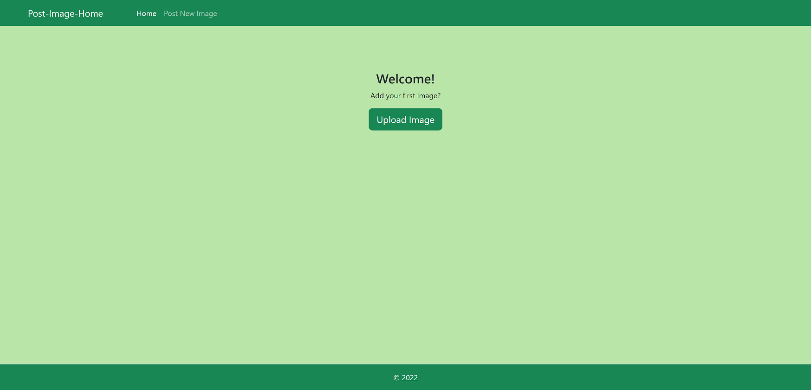
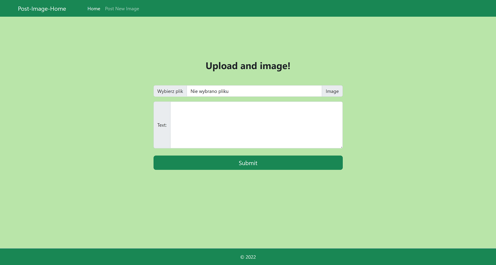
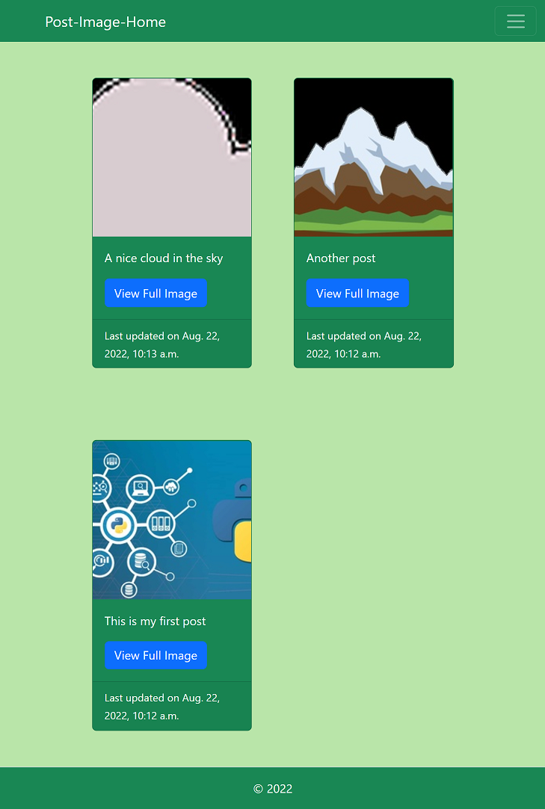

# Image_posting_website

This is a responsive website that works like a blog where anyone can post an image and a short description of it. After adding it, the picture will be displayed with the text and date added on the website in a chronological order (starting from the most recent). A successful post will be indicated with a short Django message that will be visible only the first time someone views the home page. All the media files are stored and managed by Django as static files. This solution needs to be adjusted in order to work in production.

Created with Django 4.1, sorl-thumbnail, Python 3.10.6 and Bootstrap 5. 

https://www.djangoproject.com/

https://github.com/jazzband/sorl-thumbnail

In order to run the program:  
1. Change the name of .env.example to .env and add your DJANGO_SECRET_KEY for your website. 
2. navigate to the main directory, which contains the entire project. 
3. python -m venv ENV - create a virtula enviromet 
4. pip install -r requirements.txt - install all the required Python libraries 
5. python manage.py migrate - execute your first migration command 
6. python manage.py createsuperuser - create a super user for your project 
7. python manage.py runserver - start your server, after which your website will be accessible via a web browser at localhost: 8000.  

Website views: 
1. Home-page-view if there aren't any image posted. 
2. Create-new-post-page-view.   
3. Home-page-view right after posting an image. 
4. Home-page-view with more pictures posted (Bootstrap 5 - cards). 
5. Detail-page-view for a posted image. 

